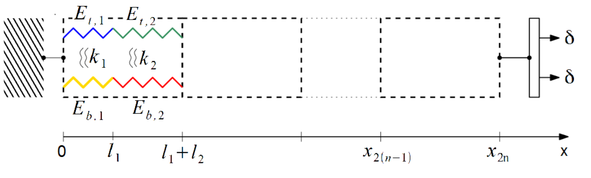
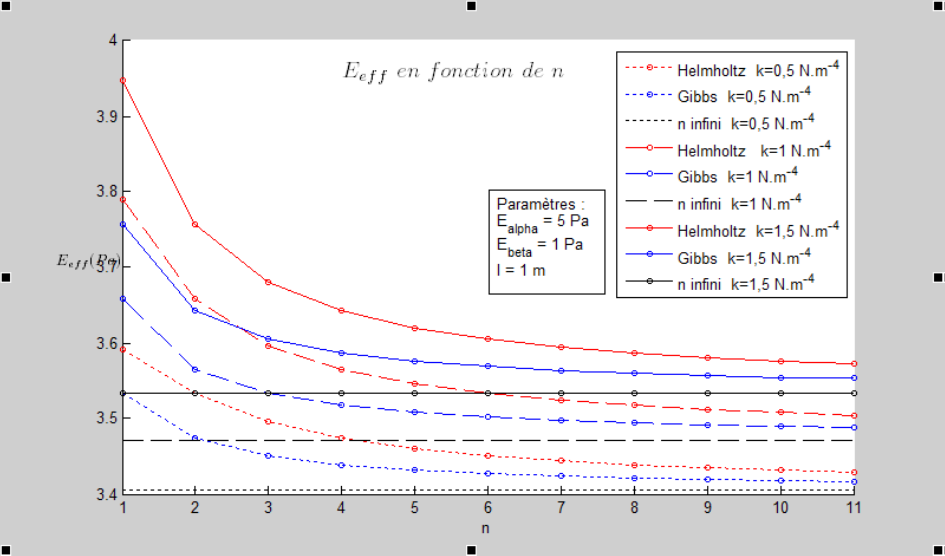
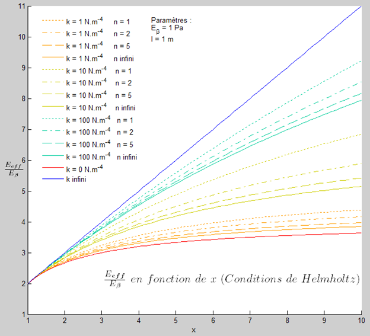

<!-- markdownlint-disable -->

# Overview

This repository contains work on the mechanical modeling of a periodic bundle of two coupled fibers and the estimation of its effective Young's modulus under different boundary-condition assumptions and parameter settings, which I carried out during my engineering studies at [Centrale Lille](https://centralelille.fr/en/) in collaboration with [IEMN](https://www.iemn.fr/en/) / [LIMMS](https://limms-tokyo.org/) as part of the [SMILL-E project](https://smmil-e.com/about/overview/) in 2015. See the full project report in French [here](fiber_bundle_modeling_report_french_2015.pdf).

# Introduction and method

Fiber-bundle models appear in biomechanics and materials science (e.g., muscle microstructure) and also in radiobiology contexts (e.g., DNA degradation under irradiation). In this project, we study a simplified but tractable mechanical model for an inhomogeneous periodic two-fiber structure subject to an axial load. The two fibers are elastically coupled: each fiber exerts an additional restoring force on the other (see figure below). We assume that: 
 1) temperature effects are negligible
 2) deformations remain small compared with the fiber length. 

One end of the structure is fixed and the other is subject to a constant force, so the response is static.

 

  
   
  Succession of <i>n</i> heterogeneous cells with Helmholtz boundary conditions.

 

Specifically, we study two boundary-condition setups that lead to different effective moduli:
- **Helmholtz-type:** imposes equal end displacements of the two fibers.
- **Gibbs-type:** imposes equal end tractions/stresses.

# Selected results

For $n$ cells in series, the coupled differential equations characterizing $\xi(x)$—the vector containing axial stresses and displacements at coordinate $x$—can be solved as: 

$\xi(n (l_1+l_2)) = A^n \xi(0)$.

Regarding results reported here, we consider a particular simplified case ($E_{t,1} = E_{b,2} = E_\alpha$, $E_{t,2} = E_{b,1} = E_\beta$, $k_1 = k_2 = k$, $l_1 = l_2 = l$). This scenario is especially interesting as the "transfer matrix" characterizing the dynamical system, $A$, can be triangularized, leading to analytical expressions (cf Section II-3 in the [report](fiber_bundle_modeling_report_french_2015.pdf)). 

The graph below shows that the effective modulus decreases with the structure length and increases with fiber coupling, and that Gibbs boundary conditions yield a lower modulus than Helmholtz conditions.

 

  
   
  Effective modulus <i>E</i>eff of the overall structure as a function of the number of cells <i>n</i> for different boundary conditions and values of the fiber coupling coefficient <i>k</i>, in a particular case.

 

We define $x = E_\alpha / E_\beta$ as the ratio between the two moduli characterizing each fiber in each cell. The graph below shows that $E_{\text{eff}}/E_{\beta}$ increases as a function of $x$ and is always lower than $1 + x$, with the equality holding for infinite coupling $k$ or for $x=1$ (case of two fibers with the same modulus) in the Helmholtz conditions.

 

  
   
  Effective modulus <i>E</i>eff of the overall structure as a function of the cell moduli ratio <i>x</i> for different values of <i>k</i> and <i>n</i>, with the Helmholtz boundary conditions in a particular case.

 

# How to reference

If you reuse this report, figures, or code, please reference:

Michel Pohl, *Modélisation biomécanique d'une structure fibrée périodique*, technical report, Centrale Lille, 2015.

Note: Work conducted in collaboration with IEMN (CNRS) under the supervision of Stefano Giordano and Fabio Manca.